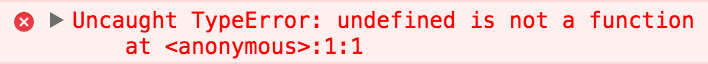
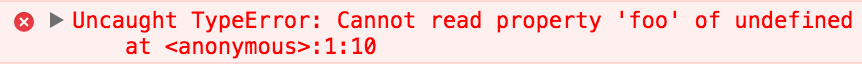
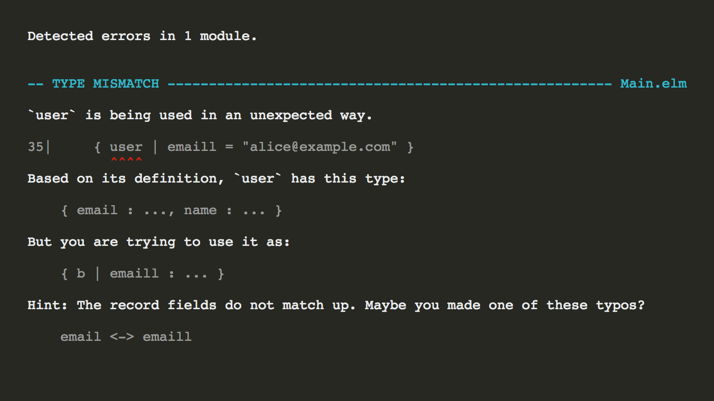
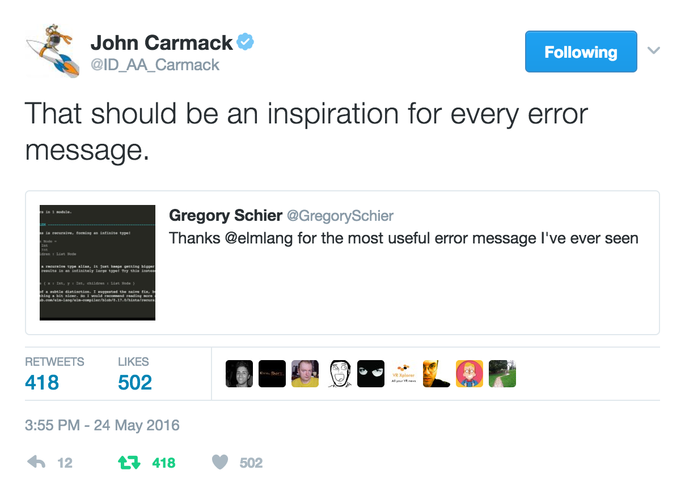
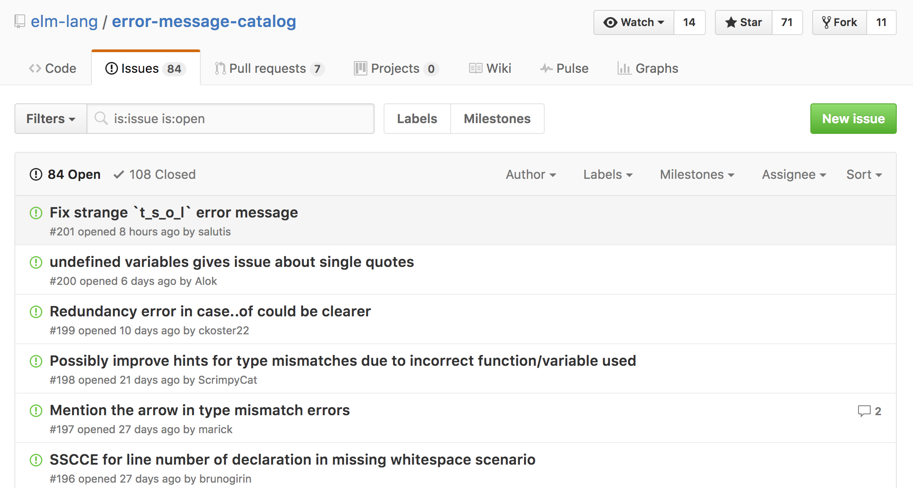
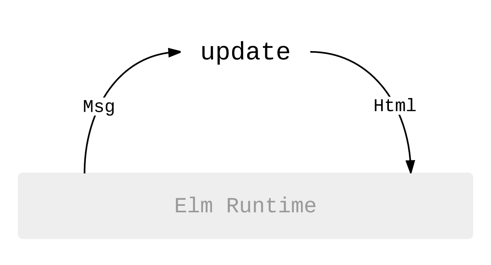

# Hello Elm!

---

"a delightful language for reliable webapps"

---

* a language
* compiles to JS
* has its own package ecosystem
* focused on building browser apps

---

```javascript
// JavaScript
function incrementAll(numbers) {
    return numbers.map(num => num + 1);
}
```

---

```elm
-- Elm
incrementAll numbers =
    List.map (\num -> num + 1) numbers
```

---

```elm
-- Elm
incrementAll : List number -> List number
incrementAll numbers =
    List.map (\num -> num + 1) numbers
```

---

* functional
* statically typed
* in the ML family (Haskell, OCaml, Purescript)

---

## Why Elm?

---



---



---

## (Almost) no runtime exceptions!

---



---

## Astonishingly helpful error messages

---



---



---

## Fearless refactoring

---

## Type-enforced semantic versioning

---

## Easy to embed inside your existing JS app

---

```
npm i react-elm-components
```

---

## Really fast HTML

---


---

## One really nice way of building apps

---



---

## It's fun!

---

## Thanks!

### `*/jamesmacaulay`

---

## www.meetup.com/Elm-Toronto

### Thursday, February 9th @ Dundas Video

---

* `elm-lang.org`
* `guide.elm-lang.org`
* `www.manning.com/books/elm-in-action`
* `pragmaticstudio.com/elm`
